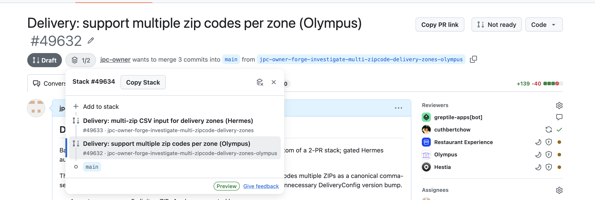

# GitHub PR Link Copier (Chromium)

A Chromium/Manifest V3 port of [justinpchang/github-pr-link-copy](https://github.com/justinpchang/github-pr-link-copy) for Brave, Chrome, Edge, and Arc. It copies GitHub pull requests as rich links with their line diff. In Slack and other rich-text editors, links paste as formatted text; plain-text editors receive Markdown:

```md
[#24 Add authentication layer `+18/-3`](https://github.com/example/repo/pull/24)
```



Use **Copy PR link** for one PR. For GitHub Stacked PRs, open the stack map and use **Copy Stack** to copy a top-to-bottom bulleted list. Private repositories work without a personal access token.

## Shortcuts

| Keys | Action |
| --- | --- |
| <kbd>c</kbd> <kbd>l</kbd> | Copy the current PR's link |
| <kbd>c</kbd> <kbd>s</kbd> | Copy the stack |

Press the keys in sequence, like GitHub's own <kbd>g</kbd> <kbd>c</kbd> shortcuts; the second key has 1.5 seconds to land. They are ignored while a text field, textarea, or comment box has focus, and while any modifier is held — <kbd>⌘C</kbd> still copies text normally.

Because a keyboard copy can happen while the buttons are scrolled out of view, the result also appears as a brief toast in the corner. <kbd>c</kbd> <kbd>s</kbd> only works where the **Copy Stack** button is — open the stack first, or the toast will say so.

Note that this claims three keys on PR pages that GitHub itself uses: bare <kbd>l</kbd> (edit labels) and <kbd>s</kbd> (focus search) still work on their own, but not within 1.5 seconds of pressing <kbd>c</kbd>, and <kbd>c</kbd> is swallowed entirely.

## Install in Brave

1. Open `brave://extensions` (Chrome: `chrome://extensions`).
2. Turn on **Developer mode** in the top-right corner.
3. Click **Load unpacked** and select this directory.
4. Reload any open GitHub PR tabs.

Unpacked extensions survive restarts, but Brave will show a "developer mode extensions" warning on each launch. To silence it, pack the extension (**Pack extension…** on the same page) and drag the resulting `.crx` onto `brave://extensions`.

## What changed from the Firefox version

- **Manifest V3.** `manifest_version: 3`, host access moved from `permissions` to `host_permissions`, and the Gecko-specific `browser_specific_settings` block is gone.
- **The diff fetch moved to a service worker** (`background.js`). `https://github.com/<owner>/<repo>/pull/<n>.diff` redirects to `patch-diff.githubusercontent.com`, which returns no CORS headers. MV2 content scripts could ignore CORS given host permissions; MV3 content scripts cannot, so the fetch runs in the extension's own network context and the text comes back over `chrome.runtime.sendMessage`. The worker only accepts canonical PR and `.diff` URLs (`core.isFetchablePrUrl`) so it can't be used as a general fetch proxy.
- **The PR page fetch stayed in the content script.** It is same-origin with github.com, so it keeps the user's session cookies — which is what makes private repos work without a token.
- **Titles come from GitHub's hovercard partial** (`/pull/<n>/hovercard`, ~4 KB) instead of the full PR page (~360 KB), roughly a third of the latency. It requires the `X-Requested-With: XMLHttpRequest` header, and the title is only trusted when the hovercard's own anchor points at the PR being fetched — GitHub answers that path with an *issue* hovercard when the number is an issue. Anything unexpected falls back to the full page fetch.
- **A stack's PRs are fetched concurrently**, and each PR's title and diff are fetched concurrently with each other. Both were serial upstream, which is what made **Copy Stack** take several seconds.
- **Keyboard shortcuts and the toast are new here** — upstream has neither. The chord is intercepted in the capture phase on `window`, which is the earliest point available and the only reliable way to beat GitHub's own `l` and `s` bindings to the key.
- Clipboard error messages no longer name Firefox. The behavior is unchanged: `navigator.clipboard.write()` first, falling back to a `contentEditable` selection plus `document.execCommand("copy")`, which is what makes the copy succeed when a slow diff fetch outlasts the click's user activation.

`content.css` and the button/stack detection logic are unchanged from upstream; `core.js` only gained `isFetchablePrUrl`.

## Develop

```sh
node --test test.js   # pure logic in core.js
./dev/run.sh          # keyboard chord, hovercard parsing, clipboard payload
```

`dev/run.sh` drives the two pages in `dev/` through headless Brave, because the chord handler, the hovercard title parsing, and the clipboard payload all need a real DOM. It stubs the network and the clipboard but runs the extension's own `content.js` unmodified, against a captured hovercard fixture. Point `BROWSER` at another Chromium binary if Brave is not at the default macOS path.

Reload the extension from `brave://extensions` after edits, then reload the GitHub tab — a reloaded extension orphans the old content script until the page refreshes.

To inspect service worker logs, click **service worker** under the extension's card on `brave://extensions`.

## Notes

- GitHub Stacked PRs is currently in private preview.
- Binary files contribute zero changed text lines because unified diffs do not contain their contents.
- Upstream ships no license file, so redistribution terms are unclear — worth asking the author before publishing this anywhere.
